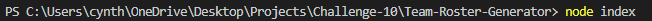
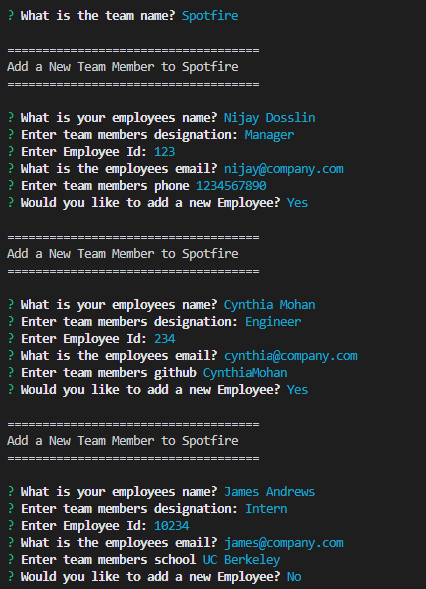
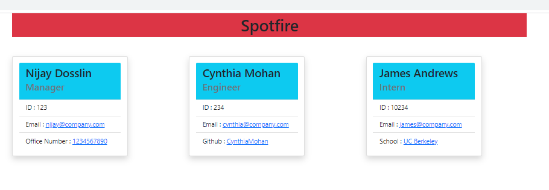
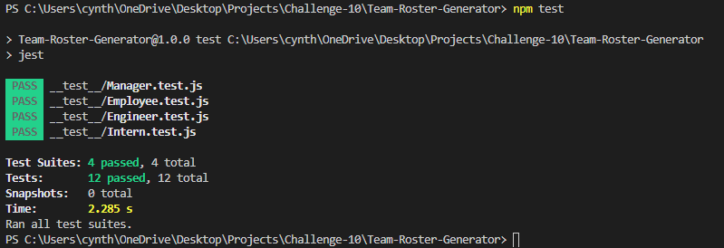

# Team-Roster-Generator

## Description
It is a command-line application that takes in information about employees on a software engineering team and generates an HTML webpage that displays summaries for each person.

## Table of Contents 

* [Installation](#installation)
* [Usage](#usage)
* [License](#license)
* [Contributing](#contributing)
* [Tests](#tests)
* [Questions](#questions)

## Installation
Install the required npm packages inquirer- for prompting  and jest-for testing. 

## Usage 
* Run project using node index 

* Enter the prompted information 

 
View the video walk through here:

https://youtu.be/iVR9Wat0SBc

 

## HTML Page Generated

## Tests
 

## Questions
View my Github Profile at [CynthiaMohan](http://github.com/CynthiaMohan)
 
Reach me with more questions <cynthiamohan1@gmail.com>

